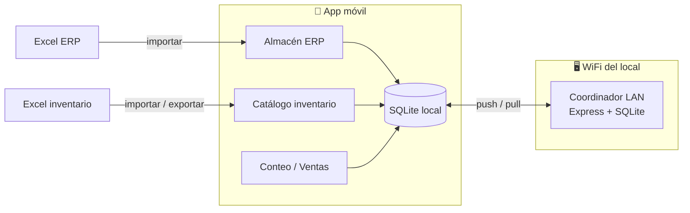
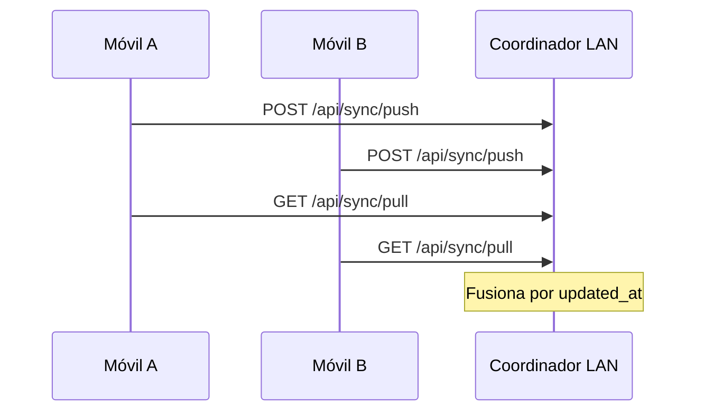

<p align="center">
  
</p>

<h1 align="center">Puyo-Motors</h1>

<p align="center">
  <strong>Inventario y consulta de almacén para autorepuestos — rápido, offline y listo para el piso de venta.</strong>
</p>

<p align="center">
  
  
  
  
  
</p>

---

## ¿Qué es?

**Puyo-Motors** es una app móvil pensada para tiendas de repuestos que necesitan dos cosas a la vez:

1. **Consultar el catálogo del ERP en el mostrador** — búsqueda inteligente por nombre, marca, familia o código, sin depender de internet.
2. **Hacer inventario físico en el local** — conteo por código de fabricante, venta rápida en jornada activa, sincronización entre varios teléfonos por WiFi y exportación a Excel.

Todo vive en el dispositivo con **SQLite**. La red local solo entra cuando quieres **fusionar conteos** entre móviles; no hay nube obligatoria.



---

## Módulos principales

### Almacén — consulta del ERP

El catálogo completo del ERP, importado desde Excel, optimizado para **encontrar piezas en segundos**:

| Capacidad | Detalle |
|-----------|---------|
| Búsqueda inteligente | Multi-palabra, sinónimos (`chev` → Chevrolet, `filt` → filtro), tolerancia a errores de tipeo |
| Prioridad por nombre | La descripción manda; el código ERP solo destaca cuando la búsqueda parece un código |
| Filtros rápidos | Sin stock, stock bajo, favoritos, por familia y marca |
| Historial y recientes | Últimas búsquedas y productos vistos |
| Estadísticas | Top productos, marcas y familias más consultadas |
| Copiar código | Un toque al portapapeles con feedback háptico |
| Header adaptable | Botón de importación que se ajusta al ancho de pantalla |

### Herramientas — operación diaria

| Sección | Para qué sirve |
|---------|----------------|
| **Catálogo** | Alta, edición y búsqueda del inventario físico; vista tabla o tarjetas |
| **Familias** | Categorías configurables (Frenos, Motor, Lubricantes…) |
| **Ajustes** | Importar/exportar Excel, sincronizar LAN, jornada de inventario, actualizaciones OTA |

### Flujos de trabajo

| Flujo | Ruta rápida |
|-------|-------------|
| Conteo físico | Catálogo → código → editar stock, costo y PVP → *Guardar y otro código* |
| Venta en jornada | Iniciar jornada → **Venta rápida** → descuenta stock al vuelo |
| Varios teléfonos | PC con coordinador LAN + IP en Ajustes → *Sincronizar ahora* |
| Cierre de inventario | Ajustes → *Exportar inventario (.xlsx)* |

---

## Inicio rápido

### Requisitos

- Node.js 18+
- [Expo Go](https://expo.dev/go) en Android/iOS **o** build EAS (recomendado para sincronización LAN en iOS)

### Instalación

```bash
git clone <repo-url>
cd control-inventario
npm install
npx expo start
```

Escanea el QR con **Expo Go** o pulsa `a` / `i` para emulador.

### Build y actualizaciones OTA

El proyecto usa **EAS Update** con `runtimeVersion: appVersion` y el canal `preview` definido en `eas.json`.

| Workflow | Archivo | Cuándo |
|----------|---------|--------|
| **OTA (JS)** | `.eas/workflows/preview-update.yml` | Push a `main` (excluye solo `.md`) o manual |
| **Build nativo** | `.eas/workflows/preview-build.yml` | Tag `preview-v*` o manual |

Requisitos para que corran solos en cada push: repo conectado a EAS y workflows habilitados en [expo.dev](https://expo.dev). Si no, ejecútalos a mano:

```bash
eas workflow:run .eas/workflows/preview-update.yml
eas workflow:run .eas/workflows/preview-build.yml
```

> `environment: preview` en un job de workflow es el **entorno de variables de EAS** (secrets del dashboard), no el canal OTA. El canal se define en `params.channel: preview`.

---

## Sincronización LAN (sin nube)

En un PC conectado al **mismo WiFi** del local:

```bash
npm run sync-server
```

La consola muestra URLs como `http://192.168.1.50:8787`. En cada móvil:

**Herramientas → Ajustes → IP del coordinador → Sincronizar ahora**

El servidor fusiona conteos por producto usando `updated_at` — **gana el registro más reciente**.



---

## Formatos Excel

### Inventario físico (importar / exportar)

| Código de producto | Descripción de producto | Unidad de medida | Stock | Precio proveedor / Costo | Precio de venta al público | Marca | Familia |
|--------------------|-------------------------|------------------|-------|--------------------------|----------------------------|-------|---------|

Al importar se aceptan abreviaturas y variantes (`codpro`, `PRECIO PROV.`, etc.). `marca` y `familia` son opcionales.

### Catálogo ERP (solo Almacén)

Columnas del export ERP: código, descripción, unidad, familia, marca, stocks, ubicación, código de barras y más. Los alias de encabezado se resuelven automáticamente (`codpro`, `stock real`, `cod.barra`…).

> **Tip:** Tras reimportar el Excel del ERP se reconstruye el índice de tokens de búsqueda.

---

## Motor de búsqueda del almacén

Diseñado para el lenguaje real del mostrador:

```
"chev filt aceit"  →  Chevrolet + filtro + aceite
"bugia toy"        →  bujía + Toyota (sinónimos ortográficos)
"12345-A"          →  prioriza coincidencia por código ERP
```

Piezas del motor (`lib/almacen/`):

| Archivo | Rol |
|---------|-----|
| `search-synonyms.ts` | Diccionario de abreviaciones y sinónimos |
| `tokenize.ts` | Normalización, fragmentos y alias al importar |
| `search-engine.ts` | Intersección multi-palabra, fuzzy, ranking y popularidad |
| `search-analytics.ts` | Productos más consultados y vistos |
| `db-queue.ts` | Cola serializada SQLite (estable en Android) |

---

## Paleta visual

Identidad **Azul · Blanco · Rojo** — definida en `constants/inventario-theme.ts`:

| Color | Uso |
|-------|-----|
| Azul `#1A4B8C` | Marca, navegación, estados positivos |
| Blanco `#FFFFFF` | Superficies y tarjetas |
| Rojo `#C41E3A` | Acciones fuertes, ventas, alertas de stock |

---

## Estructura del proyecto

```
control-inventario/
├── app/                    # Rutas Expo Router
│   ├── (tabs)/
│   │   ├── almacen/        # Consulta ERP + detalle producto
│   │   └── herramientas/   # Catálogo, familias, ajustes
│   ├── conteo/             # Pantalla de conteo por código
│   ├── venta-rapida.tsx    # Ventas en jornada activa
│   └── inventario-en-curso.tsx
├── components/
│   ├── almacen/            # Tarjetas, filtros, estadísticas
│   ├── herramientas/       # Paneles de herramientas
│   └── inventario/         # Formularios y listas de producto
├── lib/
│   ├── almacen/            # Motor de búsqueda + repositorio ERP
│   ├── db/                 # SQLite inventario + sync
│   └── excel-*.ts          # Importación / exportación Excel
├── sync-server/            # Coordinador LAN (Express)
└── constants/              # Tema y configuración visual
```

---

## Scripts

| Comando | Descripción |
|---------|-------------|
| `npx expo start` | Servidor de desarrollo y QR |
| `npm run android` | Abrir en Android |
| `npm run ios` | Abrir en iOS |
| `npm run sync-server` | Coordinador de inventario en red local |
| `npm run sync-server:install` | Instalar dependencias del coordinador |
| `npm run lint` | ESLint (config Expo) |

---

## Stack tecnológico

| Capa | Tecnología |
|------|------------|
| Framework | [Expo SDK 54](https://docs.expo.dev/versions/v54.0.0/) + Expo Router 6 |
| UI | React Native 0.81 · React 19 · New Architecture |
| Datos locales | expo-sqlite |
| Excel | xlsx |
| Sync LAN | Express + better-sqlite3 |
| Actualizaciones | expo-updates + EAS |
| UX | expo-haptics · expo-clipboard · expo-document-picker |

---

## Flujo recomendado (primer día)

1. **Familias** — revisa o crea categorías (Frenos, Suspensión, etc.).
2. **Importar catálogo** — Excel de inventario en Ajustes, o productos uno a uno en Catálogo. Los códigos se guardan en **MAYÚSCULAS**.
3. **Importar almacén ERP** — pestaña Almacén → *Importar Excel* con el export del ERP.
4. **Conteo** — filtra familia, escribe código; si no existe, *Crear y contar*.
5. **Varios móviles** — levanta el coordinador LAN y sincroniza.
6. **Cierre** — exporta el `.xlsx` y comparte el archivo.

---

<p align="center">
  <sub>Hecho para el mostrador — rápido, offline y sin fricción.</sub>
</p>
