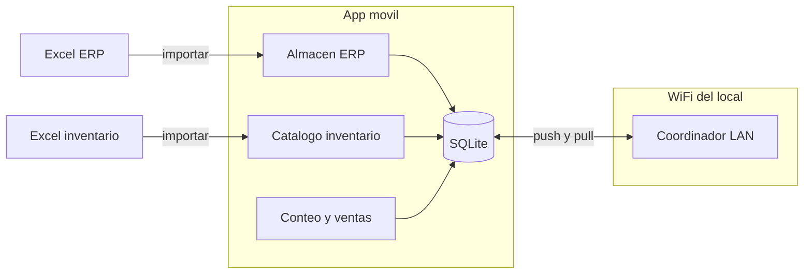
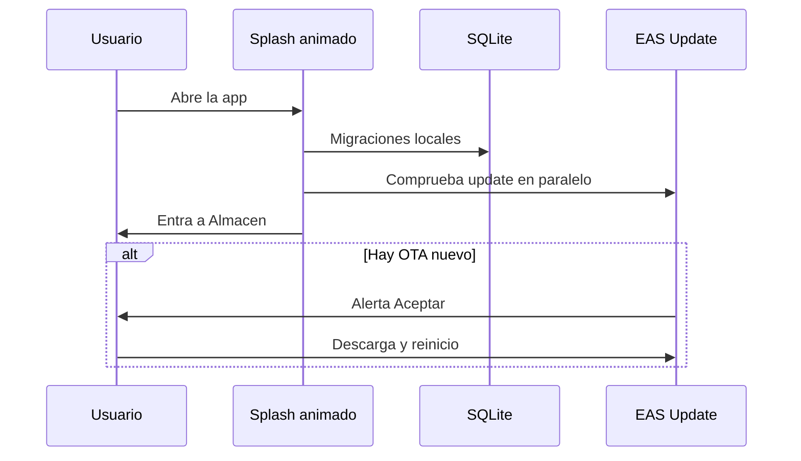
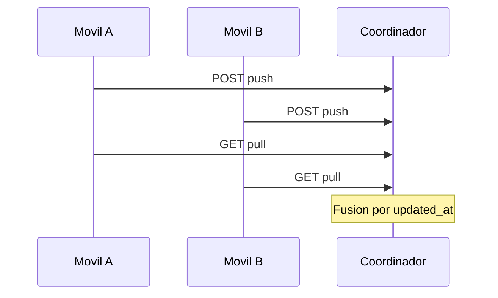

<p align="center">
  
</p>

<h1 align="center">Puyo-Motors</h1>

<p align="center">
  <strong>Inventario y consulta de almacén para autorepuestos — rápido, offline y listo para el mostrador.</strong>
</p>

<p align="center">
  
  
  
  
  
</p>

<p align="center">
  <a href="#qué-es">Qué es</a> ·
  <a href="#módulos">Módulos</a> ·
  <a href="#inicio-rápido">Inicio rápido</a> ·
  <a href="#ci--releases">CI / Releases</a> ·
  <a href="#sincronización-lan">Sync LAN</a> ·
  <a href="#estructura">Estructura</a>
</p>

---

## Qué es

**Puyo-Motors** es una app móvil para tiendas de repuestos que combina dos mundos en un solo APK:

| Módulo | Para qué |
|--------|----------|
| **Almacén** | Consultar el catálogo del ERP en el mostrador (búsqueda inteligente, sin internet) |
| **Herramientas** | Inventario físico, conteo, ventas en jornada, familias, Excel y sync entre móviles |

Los datos viven en **SQLite** en el teléfono. La red solo se usa para **fusionar inventarios** entre varios dispositivos en la WiFi del local, o para **actualizaciones OTA** vía EAS.

### Arquitectura



### Flujo de arranque



---

## Módulos

### Almacén — consulta ERP

Catálogo importado desde Excel del ERP, optimizado para el lenguaje del mostrador:

| Capacidad | Detalle |
|-----------|---------|
| Búsqueda inteligente | Multi-palabra, sinónimos (`chev` → Chevrolet), tolerancia a errores |
| Prioridad por nombre | El código ERP solo destaca cuando la búsqueda parece un código |
| Filtros | Sin stock, stock bajo, favoritos, familia, marca |
| Historial y recientes | Últimas búsquedas y productos vistos |
| Estadísticas | Top productos, marcas y familias consultadas |
| Detalle compacto | Grid 2 columnas: stock, ubicación, código de barras, etc. |
| Copiar código ERP | Un toque al portapapeles con feedback háptico |

Ejemplos de búsqueda:

```
chev filt aceit   →  Chevrolet + filtro + aceite
bugia toy         →  bujía + Toyota
12345-A           →  prioriza coincidencia por código ERP
```

### Herramientas — operación diaria

| Sección | Función |
|---------|---------|
| **Catálogo** | Alta, edición, búsqueda; vista tabla o tarjetas |
| **Familias** | Categorías (Frenos, Motor, Lubricantes…) |
| **Ajustes** | Excel, sync LAN, jornada, venta rápida, info OTA |

### Flujos clave

| Flujo | Cómo |
|-------|------|
| Conteo físico | Catálogo → código → stock / costo / PVP → _Guardar y otro código_ |
| Venta en jornada | Iniciar jornada → **Venta rápida** |
| Varios teléfonos | `npm run sync-server` en PC + IP en Ajustes → _Sincronizar_ |
| Cierre | Ajustes → _Exportar inventario (.xlsx)_ |

---

## Inicio rápido

### Requisitos

- Node.js 18+
- Android: **APK EAS** (recomendado) o [Expo Go](https://expo.dev/go) para desarrollo
- iOS: Expo Go o build EAS (sync LAN requiere build nativo)

### Instalación

```bash
git clone https://github.com/Andres12309/control-inventory.git
cd control-inventario
npm install
npx expo start
```

### Scripts

| Comando | Descripción |
|---------|-------------|
| `npx expo start` | Dev server + QR |
| `npm run android` | Emulador / dispositivo Android |
| `npm run ios` | Simulador iOS |
| `npm run sync-server` | Coordinador LAN en el PC |
| `npm run lint` | ESLint |

---

## CI / Releases

Ramas: **`develop`** (trabajo diario) → **`main`** (estable / producción).

| Acción | Qué pasa |
|--------|----------|
| Push a `develop` con `EAS update: …` en el commit | Publica OTA al canal `preview` |
| PR abierto o actualizado hacia `main` | Build Android APK (perfil `preview`) |
| Abrir la app (APK) con OTA disponible | Alerta → **Aceptar** → descarga y reinicio |

### Workflows EAS

| Workflow | Archivo | Trigger |
|----------|---------|---------|
| OTA | `.eas/workflows/preview-update.yml` | Push `develop` + mensaje `EAS update:` |
| Build | `.eas/workflows/preview-build.yml` | PR hacia `main` |

Ejemplo de commit para publicar OTA en preview:

```bash
git commit -m "EAS update: mejora detalle de almacen"
git push origin develop
```

Manual:

```bash
eas workflow:run .eas/workflows/preview-update.yml
eas workflow:run .eas/workflows/preview-build.yml
```

Build local:

```bash
eas build --platform android --profile preview
eas update --channel preview --message "Hotfix mostrador"
```

> Repo conectado a [expo.dev](https://expo.dev) · `runtimeVersion: appVersion` · canal `preview` en `eas.json`

---

## Sincronización LAN

En un PC en la **misma WiFi** del local:

```bash
npm run sync-server
```

En cada móvil: **Herramientas → Ajustes → IP del coordinador → Sincronizar ahora**

El coordinador fusiona por `updated_at` — gana el registro más reciente.



---

## Formatos Excel

### Inventario físico

| Código | Descripción | U.M. | Stock | Costo | PVP | Marca | Familia |
|--------|-------------|------|-------|-------|-----|-------|---------|

Variantes de encabezado aceptadas: `codpro`, `PRECIO PROV.`, etc.

### Catálogo ERP (Almacén)

Export del ERP: código, descripción, familia, marca, stocks, ubicación, código de barras…  
Alias automáticos: `codpro`, `stock real`, `cod.barra`…

---

## Motor de búsqueda (`lib/almacen/`)

| Archivo | Rol |
|---------|-----|
| `search-synonyms.ts` | Abreviaciones y sinónimos del mostrador |
| `tokenize.ts` | Normalización e índice al importar |
| `search-engine.ts` | Multi-palabra, fuzzy, ranking |
| `search-analytics.ts` | Productos más consultados |
| `db-queue.ts` | Cola SQLite estable en Android |

---

## Paleta visual

**Azul · Blanco · Rojo** — `constants/inventario-theme.ts`

| Color | Hex | Uso |
|-------|-----|-----|
| Azul | `#1A4B8C` | Marca, navegación |
| Blanco | `#FFFFFF` | Superficies |
| Rojo | `#C41E3A` | Ventas, alertas, acentos |

---

## Estructura del proyecto

```
control-inventario/
├── app/
│   ├── _layout.tsx           # Splash, SQLite, OTA al arranque
│   ├── (tabs)/
│   │   ├── index.tsx         # Tab Almacén (ruta /)
│   │   ├── almacen/          # Detalle /almacen/[codigo]
│   │   └── herramientas/     # Catálogo, familias, ajustes
│   ├── conteo/[codpro].tsx
│   ├── venta-rapida.tsx
│   └── inventario-en-curso.tsx
├── components/
│   ├── app/AppSplash.tsx     # Splash animado de marca
│   ├── almacen/
│   ├── herramientas/
│   └── inventario/
├── lib/
│   ├── almacen/              # Motor búsqueda ERP
│   ├── db/                   # SQLite inventario
│   ├── app-updates.ts        # OTA y info de build
│   └── app-bootstrap.ts      # Arranque robusto
├── sync-server/              # Coordinador Express (LAN)
├── .eas/workflows/           # CI EAS
└── constants/
```

---

## Stack

| Capa | Tecnología |
|------|------------|
| Framework | [Expo SDK 54](https://docs.expo.dev/versions/v54.0.0/) + Expo Router 6 |
| UI | React Native 0.81 · React 19 · New Architecture |
| Datos | expo-sqlite |
| Excel | xlsx |
| Sync LAN | Express + JSON local (`sync-server/`) |
| Releases | EAS Build + EAS Update |
| UX | Reanimated · expo-haptics · expo-clipboard · expo-image |

---

## Primer día en la tienda

1. **Familias** — crea o revisa categorías.
2. **Importar inventario** — Excel en Ajustes (códigos en MAYÚSCULAS).
3. **Importar almacén ERP** — tab Almacén → _Importar Excel_.
4. **Conteo** — código → stock; _Crear y contar_ si no existe.
5. **Varios móviles** — coordinador LAN + sincronizar.
6. **Cierre** — exportar `.xlsx`.

---

<p align="center">
  <sub>Hecho para el mostrador — rápido, offline y sin fricción.</sub>
</p>
